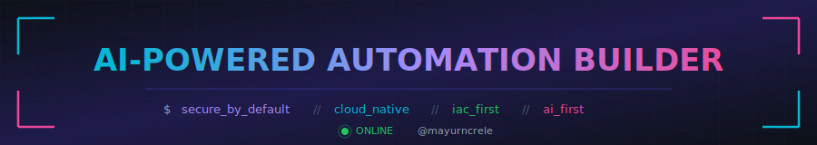

<!-- Profile README for @mayurncrele -->

<!-- Banner: gradient header, brighter palette in dark mode so it pops on #0d1117 -->
<a href="https://github.com/mayurncrele">
  <picture>
    <source media="(prefers-color-scheme: dark)" srcset="https://capsule-render.vercel.app/api?type=waving&color=0:8b5cf6,100:c4b5fd&height=200&section=header&text=Mayur%20Rele&fontSize=58&fontColor=ffffff&fontAlignY=38&_v=2" />
    
  </picture>
</a>

<!-- Typing tagline -->
<p align="center">
  <picture>
    <source media="(prefers-color-scheme: dark)" srcset="https://readme-typing-svg.demolab.com?font=JetBrains+Mono&size=20&duration=3000&pause=800&color=C0A6FF&center=true&vCenter=true&width=900&lines=Senior+Director%2C+IT+%26+Information+Security+%40+Parachute+Health;AI%2FML+Researcher+%E2%80%A2+IEEE+Senior+Member+%E2%80%A2+Author;Building+secure%2C+cloud-native%2C+AI-driven+platforms" />
    
  </picture>
</p>

<!-- AI-Powered Automation Builder hero — custom cyberpunk-style SVG -->
<p align="center">
  
</p>

<p align="center">
  <a href="https://www.linkedin.com/in/mayur-rele-97516868"></a>
  <a href="https://scholar.google.com/citations?user=SASM1f4AAAAJ&hl=en"></a>
  <a href="http://mayurrele.io"></a>
  
</p>

---

### whoami

```yaml
name:        Mayur Rele
title:       Senior Director, IT & Information Security
company:     Parachute Health
location:    [New Jersey, NYC]
focus:       [Cloud Security, AI Governance, IaC at Scale, AI-driven SIEM]
credentials: [IEEE Senior Member, 30+ publications, Book author]
advising:    [Nightfall AI, EC-Council]
```

---

### What I'm doing right now

- Designing **AI-driven SIEM** and incident automation for healthcare workloads
- Scaling **Terragrunt + IaC** across multi-account AWS estates
- Operationalizing **AI governance** for engineering orgs (HITRUST, SOC 2)
- Researching **EHR multimodal ML**, malware detection, smart-grid security

> Ask me about: agentless HIPS/FIM, route-based VPNs on Cisco ASA (VTIs), Slack-first SecOps, trading analytics.

---

### Selected wins

|     |     |
| --- | --- |
| 🛡️ **Slack-first incident fabric** | Cut MTTR and Q&A load by **~70%** across IT/SecOps |
| 📐 **AI governance blueprint** | Adopted internally and cited at industry events |
| 📚 **30+ publications** | IEEE conferences/journals — reviewer & editor |
| 🎤 **Talks & advisory** | Nightfall AI, EC-Council, IEEE program committees |

---

### What I write daily

> Most of my code lives in private Parachute Health repos, so the public language widgets here only see a sliver. The detailed metrics image below is auto generated with GHA.

<p>
  
</p>

**Infra & IaC** &nbsp;·&nbsp; AWS and GCP · Terragrunt · Terraform · EKS · k8s · Argo CD and Workflows · GitHub Actions · Helm charts · n8n
**Languages** &nbsp;·&nbsp; Python · Bash · YAML (a *lot* of YAML) · HCL · SQL
**Security** &nbsp;·&nbsp; Lacework · Drata · Nightfall · CrowdStrike · Cisco ASA (VTI) · Zscaler · Site Shield, WAF & BOT defender
**Data / ML** &nbsp;·&nbsp; PyTorch · scikit-learn · DuckDB · Datadog · BigQuery
**How I work** &nbsp;·&nbsp; IaC-first · Slack-native runbooks · paved-road platforms

---

### GitHub activity

<p align="center">
  <picture>
    <source media="(prefers-color-scheme: dark)" srcset="https://streak-stats.demolab.com?user=mayurncrele&hide_border=true&background=0d1117&stroke=0d1117&ring=c0a6ff&fire=c0a6ff&currStreakLabel=c0a6ff&sideLabels=c9d1d9&currStreakNum=c9d1d9&sideNums=c9d1d9&dates=8b949e" />
    
  </picture>
</p>

<p align="center">
  
</p>

> _The image above is regenerated daily by a private workflow with an authorized token, so it includes private and org repo activity._

---

### Writing & talks

- **AI-driven SIEM for healthcare** — pattern + reference architecture
- **Responsible AI in engineering orgs** — governance blueprint
- **Route-based VPN migration on Cisco ASA (VTIs)** — guide & sample configs
- Full list → [Google Scholar](https://scholar.google.com/citations?user=SASM1f4AAAAJ&hl=en)

---

<p align="center">
  <i>"The best security control is the one that runs by itself, every time, with an audit trail no one had to write."</i>
</p>

<picture>
  <source media="(prefers-color-scheme: dark)" srcset="https://capsule-render.vercel.app/api?type=waving&color=0:c4b5fd,100:8b5cf6&height=80&section=footer&_v=2" />
  
</picture>
